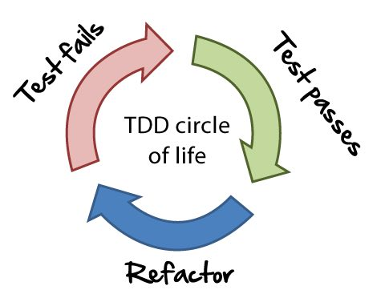

### @color[orange](Testable code)

#### Making the testing world better

---
### Who am I

- @color[black](Tech Lead at kiwi.com)
- @color[black](Live in Prague, Czech Republic)
- @color[black](Love Python & open-source)

Note:
Hello everyone, my name is Dmitry Dygalo and I am a technical team lead at kiwi.com. 
I live in Prague and I like to build tools in Python. Also I like to contribute to open-source projects.
Currently, I’m working on splitting a big legacy monolith into small and handy microservices. 
This kind of activity often goes together with refactoring and fixing old problems. 

---
### Let's make things right (again)!


Note:
If we are starting with a fresh new project, then why not do things right (again?) at the beginning?

---
### What does "testable code" mean

@ul
- @color[black](Easy to setup a testing environment)
- @color[black](Predictable)
- @color[black](Manageable)
@ulend

Note:
- How many of you write tests?
- my mission today is to increase that number 
- But, what does "testable code" mean?
- Sometimes it’s tough to make code testable, especially in a large, legacy codebase,
but I’d like to tell you some approaches and tips, that could help you make your code more predictable and manageable.

---
@transition[none]
@snap[north]
<h3>Global variables</h3>
@snapend

Note:
Let's start with global variables. These variables are generally accessible from any place of the program. 
I won’t talk about exceptions, because they don’t change the overall picture.

+++
@transition[none]
@snap[north]
<h3>Global variables</h3>
@snapend
```python
var = 0


def increment():
    global var
    var += 1
```

##### Simple global variable

Note:
The simplest possible example with `global` keyword.

+++
@transition[none]
@snap[north]
<h3>Global variables</h3>
@snapend
```python
class Holder:

    def __init__(self):
        self.value = 0

    def increment(self):
        self.value += 1

    def decrement(self):
        self.value -= 1

shared_holder = Holder()

def increment():
    shared_holder.increment()
```

##### Another example

Note:
Or it could be an instance of a class.
We modify the inner state of this object in other places.

+++
@transition[none]
@snap[north]
<h3>Global variables</h3>
@snapend
```python
# database.py
engine, db = create_db('<URI>')

# another.py
from .database import db  # `create_db` is called during the import
```

##### Even the database is global

Note:
It could be even a database connection on the module level. When you import this `database` module you're creating a connection to the database.

---
## Context matters


Note:
Global variables are not bad but often used in a wrong context. Context matters.
We have to use the right tool for the right job. Let’s look at what happens when global variables are misused.

---
### It is harder to test

```python
def test_increment():
    shared_holder.increment()
    assert shared_holder.value == 1


def test_decrement():
    shared_holder.decrement()
    assert shared_holder.value == -1
```

##### The state is shared

Note:
Having global variables makes it harder to set up a clean environment for a test. 
It means that the global state is shared across test runs. 
If you change a global state, then you’ll have to reset it for the next test, and so on.
The second test will fail because the shared_holder object is the same in both tests and it was modified during the first test. 
ALso, which test will fail in this suite depends on the execution order, which is another bad thing.

---
@transition[none]
@snap[north]
<h3>Thread-safety</h3>
@snapend

```python
import time
from threading import Thread

def increment():
    for i in range(500000):
        shared_holder.increment()

if __name__ == '__main__':
    start = time.time()
    threads = [Thread(target=increment) for _ in range(2)]
    for thread in threads: thread.start()
    for thread in threads: thread.join()
    print(shared_holder.value)
    print(time.time() - start)
```

##### Naive version

Note:
Having global variables accessible by multiple threads often implies usage of synchronisation mechanisms, 
which makes the code more complicated and also affects performance.
What should be the final value in shared_holder? One million, right?

+++
@transition[none]
@snap[north]
<h3>Thread-safety</h3>
@snapend

```bash
$ python not_thread_safe.py
889706
0.2428889274597168
```

##### Did you expect 1000000?

+++
@transition[none]
@snap[north]
<h3>Thread-safety</h3>
@snapend

```python
class Holder:

    def __init__(self):
        self.value = 0
        self._lock = threading.Lock()

    def increment(self):
        with self._lock:
            self.value += 1
```

##### Thread-safe version

Note:
We need to use a lock to achieve tread-safety.

+++
@transition[none]
@snap[north]
<h3>Thread-safety</h3>
@snapend

```bash
$ python thread_safe.py
1000000
0.49862122535705566
```

##### And it is slower

+++
@transition[none]
@snap[north]
<h3>Global variables</h3>
@snapend

@ul
- @color[black](Less predictable -> more complicated)
- @color[black](Harder to debug -> less fun)
- @color[black](Or more fun, depends on you)
@ulend

---
## If anybody can change it - you can't rely on it.

---

### You can't avoid it completely

##### There are many global variables in these modules

@ul
- @color[black](`os`)
- @color[black](`sys`)
- @color[black](`logging`)
- @color[black](A lot of them)
@ulend

Note:
But, you can’t entirely avoid a global state, because something’s always global. 
Any ideas what is that?
For example, the runtime environment is global. Your os, sys are both in this category.

---
## Use the right tool for the right job


Note:
And it is OK to have them, because, again, the context matters. Use the right tool for the right job. 
It’s handy to use global variables in small and simple programs with a few modules if it doesn’t introduce 
the complexity mentioned above, or at the very least, this behaviour is isolated and manageable.

---
@transition[none]
@snap[north]
<h3>How not to fix it</h3>
@snapend

```python
# decrementer.py
from .holder import shared_holder


def decrement():
    shared_holder.decrement()
```

Note:
Now I want to illustrate one dangerous approach, that could cause you a lot of pain.
In some cases, to make things work, you could monkey patch the module with a newly created object.
By the way, who know what the monkey patching is? Any big fans? Guilty pleasure, right?
Ok, so monkey patching is dynamic modifications of an object at runtime. 
Usually we need this to adapt some third party code, make some workarounds to a bug or change some feature that acts not in a desired way.

Let's assume, that we have a separate module, that use this shared holder and decrements its value.

+++
@transition[none]
@snap[north]
<h3>How not to fix it</h3>
@snapend

```python
import pytest
from . import decrementer, holder

@pytest.fixture
def new_holder():
    return holder.Holder()

@pytest.fixture(autouse=True)
def patched(monkeypatch, new_holder):
    monkeypatch.setattr(decrementer, 'shared_holder', new_holder)

def test_holder():
    holder.shared_holder.increment()
    assert holder.shared_holder.value == 1

def test_decrementer():
    decrementer.decrement()
    assert decrementer.shared_holder.value == -1
```

Note: 
In the example above, the monkeypatch fixture from py.test is used. It allows you to modify objects and rollback these changes automatically at the end of a test.
The patched fixture monkey patches the loaded module with freshly created Holder instance. 
If you remove this fixture, then test_decrementer will fail, because it will use a global variable that changed in test_holder.

+++
@transition[none]
@snap[north]
<h3>How not to fix it</h3>
@snapend

##### What is wrong?

@ul
- @color[black](Complexity grows very fast)
- @color[black](Weaker tests)
- @color[black](Decreases code coverage)
- @color[black](Fragile test suite)
@ulend

Note:
Whats wrong with that? Complexity grows dramatically fast
Your integration tests will be weaker, because they test less real code and more mocked code.
It decreases the actual code coverage. 
Also, the test suite becomes more fragile, since some tests could depend on the execution order.

---
### It could fix some symptoms, but it doesn't fix the problem


Note:
In large projects, it could lead to monkey patching a significant amount of different modules.

---
### Let's make it better

Note:
The global state in the previous examples is hardly predictable. Let’s change it and make it manageable.
The first step is to take control when the object is initialised. 
We want to initialise it only when we need it; just in the desired context.

---
@transition[none]
@snap[north]
<h3>Deferred initialization</h3>
@snapend

```python
class Extension:

    def __init__(self, app=None):
        self.app = app
        if app is not None:
            self.init_app(app)

    def init_app(self, app):
        app.config.setdefault('CONFIG', 'value')
        app.teardown_appcontext(self.teardown)

    def teardown(self, exception): ...

ext = Extension()
# app.py
ext.init_app(app)
```

Note:
Flask has a beautiful way of solving this problem — init_app pattern. 
It allows you to isolate some global state in an object and control when to initialise it. 
Also, it used to register some teardown logic for this global object.

+++
@transition[none]
@snap[north]
<h3>Before</h3>
@snapend

```python
# database.py
engine, db = create_db(settings.db_url)

# app.py
from flask import Flask

application = App(__name__)

# conftest.py
import database


@pytest.fixture(scope='session', autouse=True)
def db_schema(db_url):
    engine = create_engine(db_url)

    # Create extensions, tables, etc

    Session = orm.scoped_session(orm.sessionmaker())
    Session.configure(bind=engine)
    session = Session()

    yield session

    Session.remove()
    # Drop tables, extensions, etc


@pytest.fixture
def db(db_schema, monkeypatch):
    db_schema.begin_nested()
    monkeypatch.setattr(database, 'db', db_schema)

    yield db_schema

    db_schema.rollback()
    db_schema.close()
```

@[1-8](Database & Application)
@[9-26])(New session)
@[29-37](Monkeypatching)

Note:
There is an example of a test setup for a Flask app with SQLAlchemy that patches the global DB connection in the conftest.

+++
@transition[none]
@snap[north]
<h3>After</h3>
@snapend

##### `Flask-SQLAlchemy` 

```python
# database.py
from flask_sqlalchemy import SQLAlchemy

db = SQLAlchemy()

# app.py
from flask import Flask

application = App(__name__)

from .database import db

db.init_app(application)

# conftest.py
from .app import application
import database


@pytest.fixture(scope="session")
def db():
    # Create extensions, tables, etc
    yield database.db
    # Drop tables, extensions, etc


@pytest.fixture(autouse=True)
def session(db):
    db.session.begin_nested()
    yield db.session
    db.session.rollback()
```

@[1-13](Database & Application)
@[15-31])(New shiny fixtures)

Note:
This is how it could be changed with `Flask-SQLAlchemy` extension.
Now the database is initialised only when the application initialises — we put the DB into application context.

+++
@transition[none]
@snap[north]
<h3>Benefits</h3>
@snapend

@ul
- @color[black](Manageable DB initialization)
- @color[black](No monkeypatching)
@ulend

Note:
As a consequence, we don’t have to initialise another database connection in tests and make monkey patches.
We’re managing this global state.

---
@transition[none]
@snap[north]
<h3>Application factory</h3>
@snapend

```python
# app.py
def create_app(settings_object, **kwargs):
    flask_app = Flask(__name__)
    flask_app.config.from_object(settings_object)
    flask_app.config.update(**kwargs)

    from .database import db

    db.init_app(flask_app)
    db.app = flask_app

    return flask_app

# conftest.py
from app import create_app


@pytest.fixture(scope="session")
def app():
    return create_app("app.settings.TestSettings")


@pytest.fixture(scope="session")
def db(app):
    # Create extensions, tables, etc
    yield database.db
    # Drop tables, extensions, etc
```

@[1-12](Application factory)
@[13-26])(New shiny fixtures)

Note:
However, application is still global, and it initializes on import. 
If we didn’t initialise the DB before running the tests, it wouldn’t work. 
To address this problem the application factory pattern exists.
The basic idea is to isolate the application instance creation in a separate function.

+++
@transition[none]
@snap[north]
<h3>Application factory</h3>
@snapend

@ul
- @color[black](Isolation. An application instance is created after the test session starts)
- @color[black](Flexibility. Parametrise with different setting)
@ulend

Note:
- Isolate the side-effects of creating an application on the module-level. 
- Flexibility — multiple apps and/ore different settings. It’s available as a fixture, which provides more flexibility (e.g., parametrization)

---
### Running speed vs. test isolation

| @color[black](Approach)      | @color[black](Speed)         | @color[black](Isolation)  |
| ------------- | -------------:| ----------:|
| @color[black](Recreate DB)   | @color[black](Slow)          | @color[black](Best)       |
| @color[black](Truncate)      | @color[black](Faster)        | @color[black](Less)       |
| @color[black](Rollback)      | @color[black](Fastest)       | @color[black](Least)      |

Note:
We fixed the global state on the Python level, but the database itself is a shared resource. 
It should be in the same state before each test run.
Here you can see a table.
There are a couple of ways of doing this:
- Creating a DB for each test case (slow/isolated)
- Recreate all DB-level entities for each test case (faster / less isolated)
- Wrap each test case in a transaction and roll it back at the end of a test case (fastest, even less isolated)

+++
### Django example

@ul
- @color[black](`TransactionTestCase` truncates all tables)
- @color[black](`TestCase` rolls back a transaction)
@ulend

Note:
but what if you need to test some logic, that involves transaction manipulations? 
For example, Django has TransactionTestCase and TestCase for dealing with different situations. 
TransactionTestCase truncates all tables and TestCase rolls back a transaction.

---
@transition[none]
@snap[north]
<h3>Dependency injection</h3>
@snapend

+++
@transition[none]
@snap[north]
<h3>Dependency injection</h3>
@snapend

```python
class BadAirplane:
    max_speed = 900
    distance = 14800

    def fly(self):
        print(
            'Fly {distance} in {time} hours'.format(
                distance=self.distance, 
                time=self.distance / self.max_speed
            )
        )
```

Note:
There is another technique that was used in the previous examples but wasn’t mentioned explicitly. Dependency injection.

+++
@transition[none]
@snap[north]
<h3>Dependency injection</h3>
@snapend

```python
class Engine:
    
    def __init__(self, max_speed, distance):
        self.max_speed = max_speed
        self.distance = distance

    @property
    def flying_time(self):
        return self.distance / self.max_speed


class GoodAirplane:

    def __init__(self, engine):
        self.engine = engine
        
    def fly(self):
        print(
            'Fly {distance} in {time} hours'.format(
                distance=self.engine.distance, 
                time=self.engine.flying_time
            )
        )
        

if __name__ == '__main__':
    engine = Engine(900, 14800)
    plane = GoodAirplane(engine)
```

@[1-10](Dependency)
@[12-28])(Injection)

Note:
Dependency injection is a software design pattern which allows you to isolate some logic in a separate entity and pass it into another one as a dependency. 

+++
@transition[none]
@snap[north]
<h3>Dependency injection</h3>
@snapend

@ul
- @color[black](Decoupling execution from implementation)
- @color[black](Easier to mock heavy dependencies)
@ulend

Note:
Applying this approach allows you to decouple the execution of a task from its implementation.
Now, you can pass any engine you want to the airplane and test its logic with different engines, or mock your engine to see if it’s too heavy for an ordinary test.
For example, you could isolate some hard-to-test logic (e.g., a 3rd party service or some heavy computations) in this “dependency” and pass a mock object in tests instead of the real one.
Flask allows you to write isolated extensions with ease, in pytest you can reuse and parametrize fixtures in tests.

---
@transition[none]
@snap[north]
<h3>Data & logic separation</h3>
@snapend

Note:
When you’re writing tests, usually you use some values as an input for your testing logic, and you expect some other values to be an output of this logic

+++
@transition[none]
@snap[north]
<h3>Data & logic separation</h3>
@snapend

```python
def test_something():
    assert something('a', 'b') == 'c'
```

Note:
But when you hardcode them inside the testing code, it makes it less extendable. 
If you keep test data separate from the test logic, it will make modifications much more manageable. 
Dependency injection’s back in the game!

+++
@transition[none]
@snap[north]
<h3>Data & logic separation</h3>
@snapend

```python
@pytest.mark.parametrize(
    'first, second, expected', 
    (
        ('a', 'b', 'c'), 
        ('b', 'a', 'd')
    )
)
def test_something(first, second, expected):
    assert something(first, second) == expected
```

Note:
Here you have pytest parametrisation and you can easily add new test cases.

+++
@transition[none]
@snap[north]
<h3>Data & logic separation</h3>
@snapend

@ul
- @color[black](Easier to add new test cases)
- @color[black](Easier to refactor tests)
@ulend

Note:
It is especially helpful if you have an extensive test suite — it can help you see similarities in your tests and 
refactor them or build some reusable tools, that might help you in the future.

---
@transition[none]
@snap[north]
<h3>More factories</h3>
@snapend

##### `factoryboy`

```python
class User(Base):
    id = Column(Integer(), primary_key=True)
    name = Column(Unicode(20))


class UserFactory(factory.alchemy.SQLAlchemyModelFactory):
    class Meta:
        model = User
        sqlalchemy_session = session   # the SQLAlchemy session object

    id = factory.Sequence(lambda n: n)
    name = 'John Doe'
```

Note:
But what if the object you’re testing is more complicated than a string? SQLAlchemy model for example. 
You could create them manually in a separate fixture, or you could use something like factory-boy.

+++
@transition[none]
@snap[north]
<h3>More factories</h3>
@snapend

##### `factoryboy`

```python
>>> UserFactory()
<User: User 1>
>>> session.query(User).all()
[<User: User 1>]
```

+++
@transition[none]
@snap[north]
<h3>More factories</h3>
@snapend

##### `pytest-factoryboy`

```python
from pytest_factoryboy import register


@register
class UserFactory(factory.alchemy.SQLAlchemyModelFactory):
    ...
```

Note:
Factory boy is very well integrated with py.test the with absolutely gorgeous pytest-factoryboy. 
Just register your factories and make sure that they’re imported in your test suite (in the root conftest.py, for example):

+++
@transition[none]
@snap[north]
<h3>More factories</h3>
@snapend

##### `pytest-factoryboy`

```python
def test_model_fixture(user):
    assert user.name == 'John Doe'


def test_factory_fixture(user_factory):
    assert user_factory().name == 'John Doe'
```

Note:
and now you magically have user and user_factory fixtures.
The user fixture corresponds to a simple factory call without arguments.

+++
@transition[none]
@snap[north]
<h3>More factories</h3>
@snapend

Check out `pytest-factoryboy`

https://github.com/pytest-dev/pytest-factoryboy

Note:
pytest-factoryboy provides a lot of different features that are worth checking out.

---
@transition[none]
@snap[north]
<h3>Why you should try TDD</h3>
@snapend



##### Quick recap

Note:
Now we're getting to the most important part of the talk. Test driven development.
In a case if you'll remember only one thing from the talk - it should be this one.
Just a brief recap, what TDD is:

1. Write a failing test
2. Add/modify the code so that the test passes
3. Refactor the test & code

Why? It just saves time and consequently money.

+++
@transition[none]
@snap[north]
<h3>Why you should try TDD</h3>
@snapend

```python
def test_users_listing(client):
    response = client.get('/users')
    assert response.status_code == 200
```

Note:
For example, you’re building a new API with Flask, and you want to add a user’s listing in the beginning.

---


Note:
This test will fail, but you’ll know why — there is no such route in your app.
Add it with a minimal stub handler and your test will pass.
Ok, but we actually need users in the response.

+++
@transition[none]
@snap[north]
<h3>Why you should try TDD</h3>
@snapend

```python
def test_users_listing(client, user):
    response = client.get('/users')
    assert response.status_code == 200
    assert response.json == [{'id': user.id, 'name': user.name}]
```

Note:
Then update your handler with the code that will query users, and the test will pass. 
After that, you do the next feature in the same way, and then another one, and so on. In the end, you’ll have each feature tested.
Then, for example, you’ll add a feature that will break other features, but luckily you’ll know about it as soon as you run your tests.
Fix it any way you want and go to the next feature.

Rapid and iterative development process is a beautiful feature of TDD. You’ll see problems very fast just by running a test suite.

+++
@transition[none]
@snap[north]
<h3>Why you should try TDD</h3>
@snapend

##### Better with pytest-xdist

```bash
pytest -f tests
```

Note:
With pytest you don’t even have to re-run it — you could use looponfailing mode from the pytest-xdist plugin.

+++
@transition[none]
@snap[north]
<h3>Why you should try TDD</h3>
@snapend

- @color[black](Saves time & money)
- @color[black](Makes you confident)
- @color[black](Simpler to do refactoring)
- @color[black](Simpler to add new features)

Note:
Also, you’ll trust your test suite, and if something fails in production, you’ll add a regression test.
It makes your more confident about your code when you’re doing refactoring or adding a new feature. 
You’ll know that the new feature won’t break other features and it’s safe to add.

+++
@transition[none]
@snap[north]
<h3>Why you should try TDD</h3>
@snapend

## It is not a silver bullet


Note:
But it’s not a silver bullet. It doesn’t mean that you won’t have to write other types of tests or won’t have to use different approaches.
Sometimes it’s just more straightforward to do something in a way you’re with. However, consider adding TDD to your arsenal, it’s worth trying to improve your development experience.

---

> Testing shows the presence, not the absence of bugs.

##### Edsger W. Dijkstra

Note:
And the most important thing is the mindset - you should treat tests & testability as first-class citizens of your development process. 

---

### Thank you

- https://github.com/Stranger6667
- https://twitter.com/Stranger6667
- https://code.kiwi.com/testable-code-making-the-testing-world-better-76b6461c630